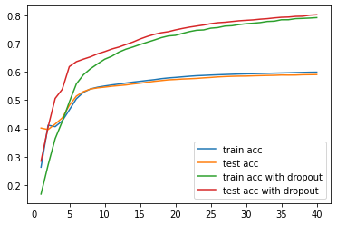
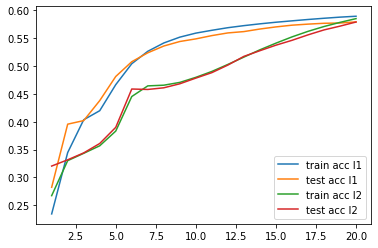
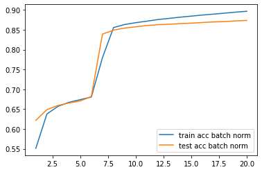
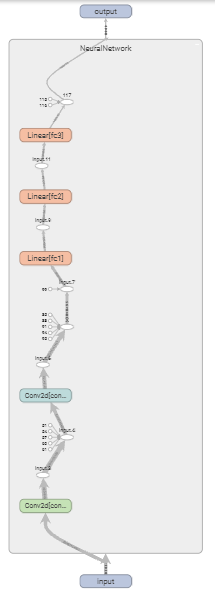
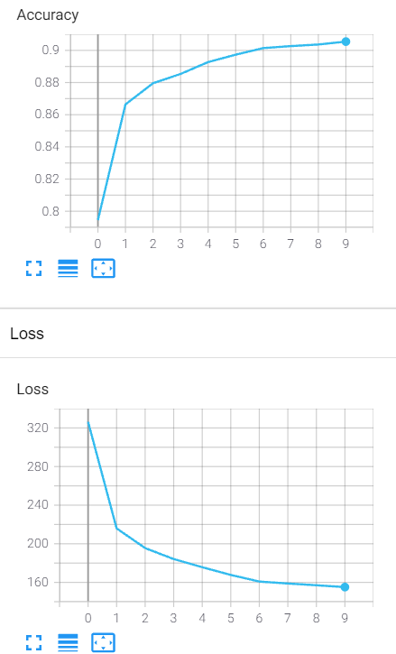
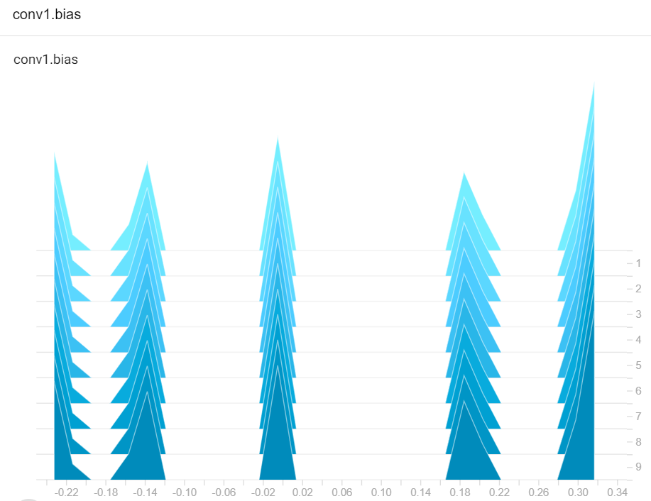

Pytorch-beginner

## 1. Python深度学习框架的选择

在学习完深度学习的理论后你可能已经跃跃欲试，想要动手开始写自己的深度学习模型，由于深度学习的复杂性，在实际工程中不可能完全从头开始写网络结构，这时候就要借助于框架，目前开源的深度学习框架大大小小有十几种，其中用户数最多的是Tensorflow，Pytorch和Keras。以下是这三个框架在全球的google trend。


其中Tensorflow出现最早，在2015年由Google开源，随后Keras在Tensorflow的基础上应运而生，而Pytorch则于2016年有Facebook开源。

在最开始学习时应该如何选择合适的框架，下面就对这三个框架进行简单的介绍。

其中Keras是基于Tensorflow开发的，是一种更高级的API，代码写法十分简洁，但同时也丧失了灵活性，因此更适合用于简单的原型展示和验证，对于希望在深度学习领域深入研究的不推荐使用Keras。

而Tensorflow和Pytorch在近年来可谓是学术和工业界并驾齐驱的两个主流框架，实际上这两个框架本身也在互相学习，借鉴了对方的优点加以改善自身（从下表就可以看出），用一张表格来总结这两个框架。

| **框架**      | **PyTorch**                                                  | **TensorFlow**                                               |
| ------------- | ------------------------------------------------------------ | ------------------------------------------------------------ |
| 计算机制      | 动态图 - 用户可以在模型运行时执行节点，也就是在运行过程中调节模型，更适合自定义，因此也使得pytorch在学术界更受欢迎 | 状态图 - 在模型运行前就被静态定义，在2019年TensorFlow 2.0也开始引入动态图的概念 |
| **模型部署**  | 在2020年引入TorchServe，功能上不如Tensorflow                 | TensorFlow Serving是其自带的模型部署工具，提供了高灵活性和 高性能的部署方式 |
| **可视化**    | PyTorch 在1.2.0 版本开始引入Tensorboard                      | Tensorboard提供了帮助用户理解神经网络的可视化工具箱          |
| **Debugging** | 更容易使用Python的标准debugger工具，如pycharm                | 较为复杂，需要学习TensorFlow的原生debugger工具tfdbg          |

（来自https://www.imaginarycloud.com/blog/pytorch-vs-tensorflow/#TensorFlow）

那么对于一个新手入门者来说，最开始应该如何选择呢？

首先一个大前提是这两个框架都是十分强大的工具，都有着完善的社区环境，在学习之前我们应该确保在理论方面对神经网络有足够的了解，这才是真正能帮助我们脱颖而出的内核，而框架只是帮助我们实现目的的工具。

如果你对python这门编程语言更熟悉，那么在当下更推荐从pytorch开始入手，你会发现在写代码时更为习惯，并且pytorch的学习曲线是更平缓的。另外对于以学术型为主的开发者来说pytorch也是更为推荐的，这得益于pytorch更为直接的debug体验。

Tensorflow通常认为是一个更为成熟的框架，在模型部署方面相比于pytorch有自己的优势，对移动平台的支持也更好。

其实也不用太过于纠结如何选择，随着这两个框架互相学习，很多特征都已经越来越像，等熟悉以后有需要再转向另一个框架也不需要太大的学习成本。

所以现在就开始奇幻的Pytorch学习之旅吧！


## 2. Pytorch搭建神经网络的基本流程

个人推荐的入门pytorch的流程：

1. 首先学习神经网络的理论知识，至少先要了解权重，学习率，激活函数，反向传播等基本概念，了解最基础的网络结构ANN,CNN,RNN等。在这里推荐一些学习材料：

   - 台湾大学李宏毅的深度学习视频 https://www.bilibili.com/video/BV1JE411g7XF

   - Coursera创始人吴恩达的深度学习视频https://www.bilibili.com/video/BV1FT4y1E74V

   - 一本从零开始徒手写神经网络的入门书籍《深度学习图解》https://book.douban.com/subject/34932968/

2. 在具有基础的理论之后，选择合适的框架（这里我们选择pytorch），通过一个基本的神经网络搭建流程把框架的使用骨架先搭出来，在这一步时先不要太深挖细节。先画骨架图了解全貌后，再往骨架中填内容，深入研究细节，这样的学习曲线是较为平缓的，不至于在一开始就劝退初学者。

   顺便说一句，Pytorch的官网提供了很多对新手很友好的例子，有时间可以选择性阅读。

   那么根据官网的[quickstart](https://pytorch.org/tutorials/beginner/basics/quickstart_tutorial.html)，总结出一个基本的Pytorch搭建神经网络的基本流程分为以下几步：

   1. 数据准备
   2. 定义模型
   3. 模型训练与验证
   4. 模型保存与加载

3. 在了解了基本流程后，开始深入填充细节，列举如下，从一个完整的流程来说加上了第五步模型部署

   1. 数据准备
      - Pytorch数据接口和使用
      - 如何自定义数据集
      - 使用Transform对rawdata做转换
   2. 定义模型
      - 如何定义神经网络类
      - 定义序列化网络容器
      - 激活函数
      - 正则化
   3. 模型训练与验证
      - 损失函数
      - 模型优化器
      - 训练loop
      - 验证loop
      - 超参数调节
      - 权重初始化
      - 模型可视化
   4. 模型保存与加载
      - 模型保存
      - 模型加载
   5. 模型部署
      - API封装
      - 容器化


现在假定你已经有了第一步的理论知识的基础，开始进入第二步的流程，了解一个基本的Pytorch训练神经网络的流程。

精炼版的四个步骤的代码如下，如果你对传统机器学习了解就会发现大体上的流程是极为类似的，现在先大致浏览一遍代码，后面会详细讲解并扩展。

```python
%matplotlib inline
```


```python
import torch
from torch import nn
from torch.utils.data import DataLoader
from torchvision import datasets
from torchvision.transforms import ToTensor, Lambda, Compose
import matplotlib.pyplot as plt
```

**一、数据准备**


```python
# Download training data from open datasets.
training_data = datasets.FashionMNIST(
    root="data",
    train=True,
    download=True,
    transform=ToTensor(),
)

# Download test data from open datasets.
test_data = datasets.FashionMNIST(
    root="data",
    train=False,
    download=True,
    transform=ToTensor(),
)
```


```python
batch_size = 64

# Create data loaders.
train_dataloader = DataLoader(training_data, batch_size=batch_size)
test_dataloader = DataLoader(test_data, batch_size=batch_size)

for X, y in test_dataloader:
    print("Shape of X [N, C, H, W]: ", X.shape)
    print("Shape of y: ", y.shape, y.dtype)
    break
```

    Shape of X [N, C, H, W]:  torch.Size([64, 1, 28, 28])
    Shape of y:  torch.Size([64]) torch.int64

**二、定义模型**


```python
# Get cpu or gpu device for training.
device = "cuda" if torch.cuda.is_available() else "cpu"
print("Using {} device".format(device))

# Define model
class NeuralNetwork(nn.Module):
    def __init__(self):
        super(NeuralNetwork, self).__init__()
        self.flatten = nn.Flatten()
        self.linear_relu_stack = nn.Sequential(
            nn.Linear(28*28, 512),
            nn.ReLU(),
            nn.Linear(512, 512),
            nn.ReLU(),
            nn.Linear(512, 10),
            nn.ReLU()
        )

    def forward(self, x):
        x = self.flatten(x)
        logits = self.linear_relu_stack(x)
        return logits

model = NeuralNetwork().to(device)
print(model)
```

    Using cpu device
    NeuralNetwork(
      (flatten): Flatten(start_dim=1, end_dim=-1)
      (linear_relu_stack): Sequential(
        (0): Linear(in_features=784, out_features=512, bias=True)
        (1): ReLU()
        (2): Linear(in_features=512, out_features=512, bias=True)
        (3): ReLU()
        (4): Linear(in_features=512, out_features=10, bias=True)
        (5): ReLU()
      )
    )

**三、模型训练与验证**


```python
loss_fn = nn.CrossEntropyLoss()
optimizer = torch.optim.SGD(model.parameters(), lr=1e-3)
```


```python
def train(dataloader, model, loss_fn, optimizer):
    size = len(dataloader.dataset)
    for batch, (X, y) in enumerate(dataloader):
        X, y = X.to(device), y.to(device)
        
        # Compute prediction error
        pred = model(X)
        loss = loss_fn(pred, y)
        
        # Backpropagation
        optimizer.zero_grad()
        loss.backward()
        optimizer.step()

        if batch % 100 == 0:
            loss, current = loss.item(), batch * len(X)
            print(f"loss: {loss:>7f}  [{current:>5d}/{size:>5d}]")
```


```python
def test(dataloader, model, loss_fn):
    size = len(dataloader.dataset)
    num_batches = len(dataloader)
    model.eval()
    test_loss, correct = 0, 0
    with torch.no_grad():
        for X, y in dataloader:
            X, y = X.to(device), y.to(device)
            pred = model(X)
            test_loss += loss_fn(pred, y).item()
            correct += (pred.argmax(1) == y).type(torch.float).sum().item()
    test_loss /= num_batches
    correct /= size
    print(f"Test Error: \n Accuracy: {(100*correct):>0.1f}%, Avg loss: {test_loss:>8f} \n")
```


```python
epochs = 5
for t in range(epochs):
    print(f"Epoch {t+1}\n-------------------------------")
    train(train_dataloader, model, loss_fn, optimizer)
    test(test_dataloader, model, loss_fn)
print("Done!")
```

    Epoch 1
    -------------------------------
    loss: 2.298313  [    0/60000]
    loss: 2.290324  [ 6400/60000]
    loss: 2.279126  [12800/60000]
    loss: 2.283089  [19200/60000]
    loss: 2.272794  [25600/60000]
    loss: 2.268349  [32000/60000]
    loss: 2.258117  [38400/60000]
    loss: 2.251492  [44800/60000]
    loss: 2.264173  [51200/60000]
    loss: 2.238919  [57600/60000]
    Test Error: 
     Accuracy: 40.1%, Avg loss: 2.239110 
    
    Epoch 2
    -------------------------------
    loss: 2.239787  [    0/60000]
    loss: 2.216787  [ 6400/60000]
    loss: 2.192778  [12800/60000]
    loss: 2.218873  [19200/60000]
    loss: 2.179190  [25600/60000]
    loss: 2.184922  [32000/60000]
    loss: 2.164321  [38400/60000]
    loss: 2.145076  [44800/60000]
    loss: 2.173346  [51200/60000]
    loss: 2.120572  [57600/60000]
    Test Error: 
     Accuracy: 44.4%, Avg loss: 2.121306 
    
    Epoch 3
    -------------------------------
    loss: 2.123722  [    0/60000]
    loss: 2.072671  [ 6400/60000]
    loss: 2.040230  [12800/60000]
    loss: 2.098472  [19200/60000]
    loss: 2.008334  [25600/60000]
    loss: 2.002212  [32000/60000]
    loss: 2.020195  [38400/60000]
    loss: 1.976064  [44800/60000]
    loss: 2.025062  [51200/60000]
    loss: 1.927013  [57600/60000]
    Test Error: 
     Accuracy: 50.6%, Avg loss: 1.949477 
    
    Epoch 4
    -------------------------------
    loss: 1.963633  [    0/60000]
    loss: 1.877309  [ 6400/60000]
    loss: 1.846219  [12800/60000]
    loss: 1.938163  [19200/60000]
    loss: 1.826020  [25600/60000]
    loss: 1.823304  [32000/60000]
    loss: 1.863928  [38400/60000]
    loss: 1.823402  [44800/60000]
    loss: 1.884976  [51200/60000]
    loss: 1.745336  [57600/60000]
    Test Error: 
     Accuracy: 52.3%, Avg loss: 1.797091 
    
    Epoch 5
    -------------------------------
    loss: 1.819813  [    0/60000]
    loss: 1.708345  [ 6400/60000]
    loss: 1.686980  [12800/60000]
    loss: 1.801250  [19200/60000]
    loss: 1.703848  [25600/60000]
    loss: 1.694704  [32000/60000]
    loss: 1.742806  [38400/60000]
    loss: 1.716054  [44800/60000]
    loss: 1.782515  [51200/60000]
    loss: 1.616319  [57600/60000]
    Test Error: 
     Accuracy: 53.1%, Avg loss: 1.685995 
    
    Done!

**四、模型保存与加载**


```python
torch.save(model.state_dict(), "model.pth")
print("Saved PyTorch Model State to model.pth")
```

    Saved PyTorch Model State to model.pth

```python
model = NeuralNetwork()
model.load_state_dict(torch.load("model.pth"))
```


```python
classes = [
    "T-shirt/top",
    "Trouser",
    "Pullover",
    "Dress",
    "Coat",
    "Sandal",
    "Shirt",
    "Sneaker",
    "Bag",
    "Ankle boot",
]

model.eval()
x, y = test_data[0][0], test_data[0][1]
with torch.no_grad():
    pred = model(x)
    predicted, actual = classes[pred[0].argmax(0)], classes[y]
    print(f'Predicted: "{predicted}", Actual: "{actual}"')
```

    Predicted: "Ankle boot", Actual: "Ankle boot"


## 3. 数据准备

### 3.1 Pytorch数据接口和使用

Pytorch提供了两个原始接口用于处理和数据相关的任务，分别是`torch.utils.data.DataLoader` 和`torch.utils.data.Dataset `。Dataset用于储存样本和对应的标签信息，Dataloader用迭代器的方式封装了Dataset。

在学习pytorch的初级阶段，我们可以直接使用自带的数据素材作为训练样本，其中有三个特定领域的库[TorchText](https://pytorch.org/text/stable/index.html)，[TorchVision](https://pytorch.org/vision/stable/index.html)和 [TorchAudio](https://pytorch.org/audio/stable/index.html)，分别包含了文本数据，图像数据和音频数据，每个库都内置了几十种经典的各自领域的数据样本。

在本节中我们就以torchvision为例，介绍图像数据集的使用。

我们将使用的数据集是[Fashion-MNIST](https://research.zalando.com/project/fashion_mnist/fashion_mnist/)数据集，是最早由Zalando在研究论文中使用的一个分类图像数据集（总共10个类别），包含60000个训练样本和10000个测试样本，每个样本都是一张28*28的灰度图像。

在使用pytorch数据准备时分为两步：

1. datasets API下载数据以及数据变换
2. Dataloader API迭代数据

第一步代码如下

```python
import torch
from torch import nn
from torch.utils.data import DataLoader
from torchvision import datasets
from torchvision.transforms import ToTensor
import matplotlib.pyplot as plt

training_data = datasets.FashionMNIST(
    root="data",
    train=True,
    download=False,
    transform=ToTensor()
)

test_data = datasets.FashionMNIST(
    root="data",
    train=False,
    download=False,
    transform=ToTensor()
)
```

datasets api接收以下这些参数作为输入

- `root`用于定义数据下载的路径
- `train` 用于标识训练集（True）还是测试集（False）
- `download`用于标识是否下载数据到定义好的root路径，第二次运行时可以改为False
- `transform` and `target_transform`分别用于进行样本和标签的转换，在这个例子中没有用到target_transform进行标签转换。请注意ToTensor()是一般都会用到的，因为pytorch中所有送入神经网络的数据结构都是张量（tensor），所以在这一步总是应当将原始数据转化为张量，关于transform的其他用法之后再详细解读。

> 知识点：什么是张量？
>
> 关于张量可以用下面这张表格很好地理解其概念。通常我们在描述一个特定的数据结构时会考虑需要用几个维度才能遍历这个数据结构中的每个元素。对这些数据结构我们都有计算机语言和数学语言两套语言来指代。例如0维数据在计算机和数学中分别称为数值和标量，1维数据分别称为数组和向量，2维数据分别称为2维数组和矩阵。张量其实是一个通用性的术语，当把上面提到的n维数据结构的概念衍生到n维时，在数学上就称为n维张量，等价于计算机语言中的n维数组。

| Indexes required | Computer science | Mathematics |
| ---------------- | ---------------- | ----------- |
| 0                | number           | scalar      |
| 1                | array            | vector      |
| 2                | 2d-array         | matrix      |
| n                | nd-array         | nd-tensor   |

第二步代码如下：

```python
batch_size = 64

train_dataloader = DataLoader(training_data, batch_size=batch_size,shuffle=True)
test_dataloader = DataLoader(test_data, batch_size=batch_size,shuffle=True)

for X, y in test_dataloader:
    print("Shape of X [N, C, H, W]: ", X.shape)
    print("Shape of y: ", y.shape, y.dtype)
    break
```

output

```python
Shape of X [N, C, H, W]:  torch.Size([64, 1, 28, 28])
Shape of y:  torch.Size([64]) torch.int64
```

我们将第一步生成的dataset作为参数送入Dataloader中，它以迭代器的方式返回一个个batch的数据。

> 知识点：Epoch, Batch
>
> Epoch: 所有训练样本都训练一轮，称为一个 Epoch
>
> Batch: 一轮训练通常会以多个batch的形式实现，假设数据集共100个样本，分成10个batch，每个batchsize是10，也就是一个epoch会训练100个全部样本，每次训练会将1个batch，也就是10个样本送入模型训练，每训练一个batch，神经网络会进行一次反向传播和梯度更新。

Dataloader API接收以下参数作为输入：

- dataset：Dataset 类，由上一步构建数据集时得到

- batchsize: 批大小

- num_works：是否多进程读取数据，默认是0，表示只使用当前进程。需要注意在windows下对多进程读取数据的效果不是很好，并且很容易出问题，对于小数据集，使用默认参数即可。

- shuffle：是否打乱顺序随机分组

- drop_last: 当样本数不能被 batchsize 整除时，是否舍弃最后一批数据

设置完Dataloader后，试着返回数据集的第一个batch，观察张量的size。

样本的size是torch.Size([64, 1, 28, 28])，四个值分别代表batchsize，channel，height，weight。batchsize是我们设置的64，也就是64张图像，channel为1表示这是一张灰度图，如果是彩色图像channel为3，高度和宽度则是单张图像的大小28*28像素。

至此我们已经学会了如何使用pytorch接口使用自带的数据集进行数据准备。下一小节将进一步学习使用transform进行数据增强。


### 3.2 自定义数据集

上一节我们学习了如何调用pytorch提供的数据集，而在实际生产过程中，我们总是会使用自己的真实数据集，因此这一节就来学习如何自定义数据集。

自定义数据集只需遵循两步：

1. 准备一个路径存放图片数据，以及一个csv文档记录对应图片名称的标签。
2. 自定义一个继承`torch.utils.data.Dataset`类的数据集子类

遵循这两个步骤，本节将自定义一个猫狗数据集。

先看第一步，在某路径下放入四张示例图片（前两张猫，后两张狗），以及一个记录了标签的文档。


打开文档里面长这样，第一列记录图片的名称，第二列记录对应的分类，0为猫，1为狗。


第一步到此已完成，开始第二步。

写一个继承了Dataset的子类后，初始化后，复写其中的`__len__`和`__getitem__`方法。

完整的类代码如下：

```python
class CatsAndDogsDataset(Dataset):
    def __init__(self,csv_file,root_dir,transform=None):
        # 读取标签文件
        self.annotations =pd.read_csv(os.path.join(root_dir,csv_file))
        # 定义文件目录
        self.root_dir=root_dir
        # 定义transform
        self.transform=transform
    
    # 返回数据集长度，此处应为4
    def __len__(self):
        return len(self.annotations)
    
    # 获取数据的方法，会和Dataloader连用
    def __getitem__(self,index):
        # 获取图片路径，0表示csv文件的第一列
        img_path=os.path.join(self.root_dir,self.annotations.iloc[index,0])
        # 读取图片
        image = io.imread(img_path)
        # 获取图片对应的标签，1表示csv文件的第二列
        y_label= torch.tensor(int(self.annotations.iloc[index,1]))
        
        # 如果使用时附加了transform参数，则对图片应用转换
        if self.transform:
            image= self.transform(image)
            
        # 返回一个图片和标签的元组
        return (image,y_label)
```

在定义完dataset后就可以实例化了。

```python
# 实例化，输入文件名称，路径和需要的数据转换
dataset = CatsAndDogsDataset(csv_file='label.csv',root_dir='data/cat_dog',transform=transforms.ToTensor())
# 划分训练集和测试集，这里是分为3个训练样本和1个测试样本
training_data,test_data = torch.utils.data.random_split(dataset,[3,1])

# 这一步开始和使用自带数据集的代码完全一致
batch_size=1
train_dataloader = DataLoader(training_data, batch_size=batch_size,shuffle=True)
test_dataloader = DataLoader(test_data, batch_size=batch_size,shuffle=True)
```

观察那一个测试样本

```python
for X, y in test_dataloader:
    print("Shape of X [N, C, H, W]: ", X.shape)
    print("Shape of y: ", y.shape, y.dtype)
    break

# 以图片的形式查看
to_pil_image = transforms.ToPILImage()
img = to_pil_image(X[0])
img.show()
```

### 3.3 Transforms对图像做转换

在上面的章节中，我们已经见到了在加载数据时用到了torchvision.transforms方法对原始数据进行张量化操作，本节将进一步介绍其他转换方法的使用。

通常对原始数据进行转换的一个主要目的是数据增强（Data Augmentation）。我们都知道，一个深度学习模型的预测准确性在很大程度上是依赖于数据集的数量和多样性的。尤其在复杂结构的神经网络中，随着隐层神经元数量的爆炸式增长，需要训练的参数量也显著增加，比如在CV领域的一个重要模型RESNET就有六千万个参数。伴随着待训练参数的增加，对数据量的要求也相应增加了。但是在实际生产环境中，收集如此庞大的数据量是一个很大的难点。

为了解决这一问题，有两种方法，第一种方式是使用迁移学习，也就是预训练一个复杂的基础模型，在其基础上迁移到实际数据上再次训练。另一种方法则是使用数据增强，数据增强可以满足数据多样性和数据量的需求，还可用于解决分类任务中的类不平衡问题。

那么应当如何进行数据增强就要用到本节提到的transforms。

依然以图像数据为例，[torchvision.transforms](https://pytorch.org/vision/stable/transforms.html#)提供了多种进行数据变换的分类，常用的就以下三类：

- 对image做变换
- 对tensor做变换
- 对类型做转换

#### 3.3.1 对image做变换

对图像做变换是最常见的操作，例如裁剪，旋转，翻转，填充等等，详细的各种变换方法可以查看transforms官方文档。

以resize为例：

定义两个不同参数的resize变换，输入一个参数时，该方法会默认以短边为100，另一边等比例缩放，输入两个参数时，则直接指定了（高度，宽度）。

```python
import torchvision.transforms as transforms
import matplotlib.pyplot as plt
resize1 = transforms.Resize(100)
resize2 = transforms.Resize((100,200))
```

定义一个plot方法，将原图和变换后的图像并排展现

```py
def plot(*imgs):
    fig, axs = plt.subplots(nrows=1,ncols=len(imgs),figsize=(10, 10))
    for i in range(len(imgs)):
        axs[i].imshow(np.asarray(imgs[i]))
```

展示变换效果

```python
plot(img,resize1(img),resize2(img))
```


#### 3.3.2 对tensor做变换

Normalize标准化是最常用的对tensor进行变换的方法。

首先计算标准化之前的均值和标准差，

```python
mean = next(iter(test_dataloader))[0].mean()
std=next(iter(test_dataloader))[0].std()
print('mean of input : {}'.format(mean))
print('std of input : {}'.format(std))
```

```
mean of input : 0.43933048844337463
std of input : 0.2347354143857956
```

先将图片转化为tensor之后，再进行标准化，再次观察均值和标准差，发现已经变成标准正态分布

```python
trans= transforms.Compose([transforms.ToTensor(),transforms.Normalize(mean,std)])
print('mean of input : {}'.format(trans(img).mean()))
print('std of input : {}'.format(trans(img).std()))
```

```
mean of input : -1.1390642384867533e-07
std of input : 0.9999999403953552
```

在这里我们用到了``transforms.Compose``，作用是将多个transforms操作结合成一个序列，从而对原始数据进行多步变化。

#### 3.3.3 对类型做转换

这一类变化的作用是将图片数据转换为张量形式，或将张量数据转换为图片形式，分别由以下这两个方法进行控制，特别注意最终送入训练模型的数据类型一定要是张量的形式。

`torchvision.transforms.ToPILImage`，`torchvision.transforms.ToTensor`


## 4. 构建模型

### 4.1 定义神经网络模型类

准备好数据后，就可以开始构建模型了，下面开始拆解在基本流程章节中展示的一个模板代码

```python
# Get cpu or gpu device for training.
device = "cuda" if torch.cuda.is_available() else "cpu"
print("Using {} device".format(device))
```

神经网络的计算有两种环境，CPU和GPU，相比于CPU，GPU通常具有上千个核心，使其更适合并行计算的场景，而这恰好是和神经网络模型结构是高度吻合的，因此用GPU计算可以显著加速网络的学习过程。

关于GPU的使用只需记住两点：

- 只有tensor格式才能传入device
- 模型和数据需要传入device

```python
# 将模型写入device
model = NeuralNetwork().to(device)

# 将训练数据写入device，下一节会讲到
for batch, (X, y) in enumerate(dataloader):
    X, y = X.to(device), y.to(device)
```

在pytorch中所有神经网络的构建一般都继承自``nn.Module``。

在类的模块中，一般也分为两部分，一个初始化方法``__init__``和一个前向传播方法``forward``。

在初始化方法中，首先使用super命令继承父类的初始化，接着定义网络结构的各层结构，这个例子就构建了一个三层网络结构，在每一层线性层之后都是用一个ReLU函数作为激活函数，激活函数的目的是引入非线性。另外，该例子使用到了``nn.Sequential``序列化容器方法来定义，之后会详细介绍。

在前向传播的方法中，则是将初始化的各层网络依次叠加，也就是上一层的输出作为下一层的输入。

最后打印模型，查看定义好的网络结构。

```python
# Define model
class NeuralNetwork(nn.Module):
    def __init__(self):
        super(NeuralNetwork, self).__init__()
        # 压平输入数据
        self.flatten = nn.Flatten()
        self.linear_relu_stack = nn.Sequential(
            nn.Linear(28*28, 512),
            nn.ReLU(),
            nn.Linear(512, 512),
            nn.ReLU(),
            nn.Linear(512, 10),
            nn.ReLU()
        )

    def forward(self, x):
        x = self.flatten(x)
        logits = self.linear_relu_stack(x)
        return logits

model = NeuralNetwork().to(device)
print(model)
```

```

NeuralNetwork(
  (flatten): Flatten(start_dim=1, end_dim=-1)
  (linear_relu_stack): Sequential(
    (0): Linear(in_features=784, out_features=512, bias=True)
    (1): ReLU()
    (2): Linear(in_features=512, out_features=512, bias=True)
    (3): ReLU()
    (4): Linear(in_features=512, out_features=10, bias=True)
    (5): ReLU()
  )
)
```

在神经网络的模型搭建中，对于初学者有一个难点是想不清楚每一层的dimension，因此不知道如何给层参数赋值。要解决这一问题，最重要是理解每一层在做什么，每个参数的含义，在此基础上，有一个第三方工具``torchsummary``可以像keras一样直观地打印出网络结构中每一层的dimension，从而帮助我们高效搭建模型。

torchsummary的使用方法非常简单，首先按照上述代码定义模型类后，实例化model，然后直接调用summary方法即可，仅需一行代码即可打印出每一层的维度，参数数量以及总共占用的内存量。

```python
from torchsummary import summary
summary(model,input_size=(1, 28, 28),batch_size=64)
```

```
----------------------------------------------------------------
        Layer (type)               Output Shape         Param #
================================================================
           Flatten-1                  [64, 784]               0
            Linear-2                  [64, 512]         401,920
              ReLU-3                  [64, 512]               0
            Linear-4                  [64, 512]         262,656
              ReLU-5                  [64, 512]               0
            Linear-6                   [64, 10]           5,130
              ReLU-7                   [64, 10]               0
================================================================
Total params: 669,706
Trainable params: 669,706
Non-trainable params: 0
----------------------------------------------------------------
Input size (MB): 0.19
Forward/backward pass size (MB): 1.39
Params size (MB): 2.55
Estimated Total Size (MB): 4.14
----------------------------------------------------------------
```


### 4.2 定义网络模型容器

在pytorch中写模型类时，最基础的方式是一层一层在初始化方法中定义layer后，在前向传播方法中逐层传播。

以quickstart中的网络结构为例，初学者通常接触到的写法是这样的，比较直观，但写法上不够简洁。

```python
class NeuralNetwork(nn.Module):
    def __init__(self):
        super(NeuralNetwork, self).__init__()
        self.flatten = nn.Flatten()
        self.linear1=nn.Linear(28*28, 512)
        self.linear2=nn.Linear(512, 512)
        self.linear3=nn.Linear(512, 10)
        self.relu1=nn.ReLU()
        self.relu2=nn.ReLU()
        self.relu3=nn.ReLU()
        
    def forward(self, x):
        x = self.flatten(x)
        x = self.linear1(x)
        x = self.relu1(x)
        x = self.linear2(x)
        x = self.relu2(x)
        x = self.linear3(x)
        x = self.relu3(x)
        return x
```

本节将介绍pytorch中模型容器的写法，模型容器提供了和上述代码不一样的构造神经网络模型的方法。

- nn.Sequential
- nn.ModuleDict
- nn.ModuleList

``nn.Sequential``提供了一种链式构造模型的方法，模型在前向传播的时候会严格遵循写入其中的顺序。

使用Sequential构造链式模型又有三种方法：

```python
# 方法1
torch.manual_seed(42)
model1 = nn.Sequential(
            nn.Linear(28*28, 512),
            nn.ReLU(),
            nn.Linear(512, 512),
            nn.ReLU(),
            nn.Linear(512, 10),
            nn.ReLU()
        )

# 方法2
torch.manual_seed(42)
layer2=OrderedDict([
    ('linear1',nn.Linear(28*28, 512)),
    ('relu1',nn.ReLU()),
    ('linear2',nn.Linear(512, 512)),
    ('relu2',nn.ReLU()),
    ('linear3',nn.Linear(512, 10)),
    ('relu3',nn.ReLU())
])
model2 = nn.Sequential(layer2)

# 方法3
torch.manual_seed(42)
model3=nn.Sequential()
model3.add_module('linear1',nn.Linear(28*28, 512))
model3.add_module('relu1',nn.ReLU())
model3.add_module('linear2',nn.Linear(512, 512))
model3.add_module('relu2',nn.ReLU())
model3.add_module('linear3',nn.Linear(512, 10))
model3.add_module('relu3',nn.ReLU())
```

第一种方法直接将各层写入nn.Sequential中，可以用位置索引获取某一层的信息，第二种方法使用了有序字典，将有序字典写入nn.Sequential中，可以用字典索引获取某一层的信息，第三种方法逐层添加模型层。

这三种模型的写法效果是一样的，用一个虚拟的数据做测试，传入同一个数据时，我们得到了完全一样的输出。

```python
X = torch.randn((1,784))
model1(X), model2(X), model3(X)
```

```
(tensor([[0.0000, 0.0066, 0.0020, 0.0000, 0.0000, 0.0000, 0.0131, 0.0932, 0.0000,
          0.0439]], grad_fn=<ReluBackward0>),
 tensor([[0.0000, 0.0066, 0.0020, 0.0000, 0.0000, 0.0000, 0.0131, 0.0932, 0.0000,
          0.0439]], grad_fn=<ReluBackward0>),
 tensor([[0.0000, 0.0066, 0.0020, 0.0000, 0.0000, 0.0000, 0.0131, 0.0932, 0.0000,
          0.0439]], grad_fn=<ReluBackward0>))
```

``nn.Sequential``写法的好处是序列中的各层网络层会自动以链式连接，在前向传播时把整个容器作为整体，写法更为简洁美观。

``nn.ModuleDict``的用法如下，在初始化时以字典的形式定义网络层，在前向传播中则以键值对的方式传入参数选择合适的网络结构，这种写法的特点是可以灵活地根据参数调整网络结构。

```python
class MyModuleDict(nn.Module):
    def __init__(self):
        super(MyModuleDict, self).__init__()
        self.choices = nn.ModuleDict({
                'conv': nn.Conv2d(10, 10, 3),
                'pool': nn.MaxPool2d(3)
        })
        self.activations = nn.ModuleDict([
                ['lrelu', nn.LeakyReLU()],
                ['prelu', nn.PReLU()]
        ])

    def forward(self, x, choice, act):
        x = self.choices[choice](x)
        x = self.activations[act](x)
        return x
    
X=  torch.randn((1, 10, 32, 32))
model_dict4= MyModuleDict()
output = model_dict4.forward(X,'conv','lrelu')
```

``nn.ModuleList``的写法如下，它的特点是以迭代的方式创建网络层，常用于大量重复网络构建。

```python
class MyModuleList(nn.Module):
    def __init__(self):
        super(MyModuleList, self).__init__()
        self.linears = nn.ModuleList([nn.Linear(10, 10) for i in range(10)])

    def forward(self, x):
        for i, linear in enumerate(self.linears):
            x = linear(x)
        return x
    
X = torch.randn((1, 10))
model5=MyModuleList()
output=model5(X)
```


### 4.3 激活函数

激活函数是神经网络设计中的一个重要部分，当作用在不同网络层时，激活函数起到不同的效果，当作用在隐层（hidden layer）时，用来控制模型如何学习训练数据的，当作用在输出层（output layer）时，用来定义模型输出预测类型。

大多数激活函数都是非线性的，一般在同一个模型中，所有隐层都会采用相同的激活函数。

#### 4.3.1 隐层的激活函数

隐层的激活函数会在其结果输出到下一层之前使用，最常见的隐层激活函数有三种：

- Rectified Linear Activation (**ReLU**)
- Logistic (**Sigmoid**)
- Hyperbolic Tangent (**Tanh**)

首先将三种激活函数画出，观察其特点

```python
import matplotlib.pyplot as plt
from math import exp

# 写出三种激活函数的表达式
# ReLU
def rectified(x):
    return max(0.0, x)

# sigmoid
def sigmoid(x):
    return 1.0 / (1.0 + exp(-x))

# tanh
def tanh(x):
    return (exp(x) - exp(-x)) / (exp(x) + exp(-x))

# 定义输入
input = [x for x in range(-6, 6)]
# 计算三种输出
relu = [rectified(x) for x in inputs]
sigmoid = [sigmoid(x) for x in inputs]
tanh = [tanh(x) for x in inputs]

# 绘制三种激活函数
plt.plot(inputs,relu,label='relu')
plt.plot(inputs,sigmoid,label='sigmoid')
plt.plot(inputs,tanh,label='tanh')
plt.legend();
```


ReLU函数表达最简单，就是在0和输入x中取最大值，当输入小于0时，输出为0，当输入大于0时，输入为线性函数。

Sigmoid函数也是logistic回归中用到的分类算法，它将输入压缩到0和1之间。

Tanh函数和Sigmoid类似，只是它将输入压缩到-1和1之间。

那么对于隐层，我们应当如何选择激活函数呢。在激活函数的选择上也一直在发生变化，曾经sigmoid和tanh都是主流的激活函数方法，目前来说，ReLU已经变成了主流，尤其是在MLP和CNN的应用上，但对于RNN/LSTM这些基于时间序列的神经网络，仍然会使用Tanh。

Tanh和Sigmoid逐渐退出舞台主要是因为随着计算机算力的提升，神经网络结构变得越来越深，而这两种激活函数由于在输入x的绝对值稍大于0时就会迅速趋于饱和，这使得导数趋于0，在很深的网络反向传播时会导致梯度消失问题，使得神经网络无法训练下去。

而ReLU则很好地避免了这一问题，除了这个优点，ReLU还有其他两个优点，一是计算简单，从上面的代码中也可以看到计算ReLU只是很简单的一步计算最大值；二是稀疏性表示(Representational Sparsity)，ReLU的一个重要优势是它能够输出真正的零值，这与tanh和Sigmoid激活函数不同，后者学习近似零输出，例如非常接近零的值，但不是真正的零值。ReLU在输入为负值时输出真正的零值可以加快学习速度并简化模型。

另外在ReLU的使用中，一个经验是对权重使用`He initialization`，这能让模型训练效果更好。


#### 4.3.2 输出层的激活函数

输出层的激活函数是指在输出最终预测结果之前施加的激活函数，对于输出层，也有三种常见的激活函数。

- Linear
- Logistic (Sigmoid)
- Softmax

线性激活函数没有对输出进行任何变化，也称为恒等激活函数，一般用的很少。

Sigmoid刚才已经做了介绍，和作用于隐层的激活函数一样。

Softmax激活函数在数学上将一个向量转化为和为一的等长向量，计算公式为$$\frac{e^x} {\sum{e^x}} $$。按照这个公式计算，一个输出层的原始输出向量[1.0, 3.0, 2.0]，在作用了Softmax激活函数后会输出[0.09003057，0.66524096，0.24472847]。

那么应当如何选择合适的输出层激活函数呢，这取决于预测的类型。对于回归问题，我们会选择线性输出层。对于分类问题，则要进一步细分三种情况，首先对于二分类问题，适用于Sigmoid激活函数，这本质上和logistic回归是一样的，对于多分类问题，则应当使用Softmax激活函数，另外还有一类特殊的多标签问题，也就是一个样本可以分类为多个标签，这时应当对每个类别使用Sigmoid激活函数。


### 4.4 正则化

和机器学习一样，正则化也是深度学习中常用的技术，使用它的主要目的是为了减小variance，从而避免过拟合现象。

经典的正则化方法有以下几种：

- Dropout - 在全连接层中随机丢弃部分神经元节点，产生一个简化了的网络结构
- L1/L2正则化 - 在原始的损失函数中增加L1/L2的惩罚项，从而限制产生较大的权重w
- Batch normalization - 控制隐层的输出在一个稳定的范围内
- 数据增强 - 通过增加数据集多样性的方式避免过拟合
- Early stopping - 在达到模型过拟合的阶段前停止训练模型

**Dropout**

dropout在pytorch中的使用非常简单，直接使用`torch.nn.Dropout`的方式调用即可，该方法有一个参数p，代表需要丢弃的节点百分比，默认值0.5表示丢弃50%的神经元节点。

以第二章的经典pytorch神经网络流程为例，在代码中只需要在定义网络结构时使用加入nn.Dropout(p)即可。

```python
def __init__(self,p):
    super(NeuralNetwork, self).__init__()
    self.flatten = nn.Flatten()
    self.linear_relu_stack = nn.Sequential(
        nn.Linear(28*28, 512),
        nn.Dropout(p),
        nn.ReLU(),
        nn.Linear(512, 512),
        nn.Dropout(p),
        nn.ReLU(),
        nn.Linear(512, 10),
        nn.ReLU()
    )
```

在使用dropout和不使用dropout的情况下分别训练模型40个epoch，观察训练集和测试集上的准确率变化曲线。

在使用dropout以后，无论是在训练集还是在测试集上模型的准确率明显提升了，也可以认为是训练地更快了。并且观察到在使用dropout的情况下，测试集上的准确率比训练集上更高，这是因为在测试集上做推理时dropout是关闭的，说明在训练集上起到了限制过拟合的作用。



Backup：上图的代码如下

```python
model_wodrop = NeuralNetwork(0).to(device)
loss_fn = nn.CrossEntropyLoss()
optimizer_wodrop = torch.optim.SGD(model_wodrop.parameters(), lr=1e-3)
model_drop = NeuralNetwork(0.5).to(device)
optimizer_drop = torch.optim.SGD(model_drop.parameters(), lr=1e-3)

def train(dataloader, model, loss_fn, optimizer):
    size = len(dataloader.dataset)
    model.train()
    train_loss=0
    correct=0
    for batch, (X, y) in enumerate(dataloader):
        X, y = X.to(device), y.to(device)
        
        # Compute prediction error
        pred = model(X)
        loss = loss_fn(pred, y)
        
        # Backpropagation
        optimizer.zero_grad()
        loss.backward()
        optimizer.step()
        train_loss+= loss.item()
        correct += (pred.argmax(1) == y).type(torch.float).sum().item()
    train_loss = train_loss/len(dataloader)
    correct /= size
    return correct

def test(dataloader, model, loss_fn):
    size = len(dataloader.dataset)
    model.eval()
    test_loss= 0
    correct=0
    with torch.no_grad():
        for X, y in dataloader:
            X, y = X.to(device), y.to(device)
            pred = model(X)
            test_loss += loss_fn(pred, y).item()
            correct += (pred.argmax(1) == y).type(torch.float).sum().item()
    test_loss = test_loss/len(dataloader)
    correct /= size
    return correct

epochs = 40
epoch_array=  np.arange(1,epochs+1,dtype=np.float64)
train_acc_wodrop = np.zeros_like(epoch_array)
test_acc_wodrop = np.zeros_like(epoch_array)
for i in range(epochs):
    train_acc_wodrop[i] =  train(train_dataloader, model_wodrop, loss_fn, optimizer_wodrop)
    test_acc_wodrop[i] =  test(test_dataloader, model_wodrop, loss_fn)
    

train_acc_drop = np.zeros_like(epoch_array)
test_acc_drop = np.zeros_like(epoch_array)
for i in range(epochs):
    train_acc_wodrop[i] =  train(train_dataloader, model_drop, loss_fn, optimizer_drop)
    test_acc_wodrop[i] =  test(test_dataloader, model_drop, loss_fn)

    
plt.plot(epoch_array,train_acc_wodrop,label='train acc')
plt.plot(epoch_array,test_acc_wodrop,label='test acc')
plt.plot(epoch_array,train_acc_drop,label='train acc with dropout')
plt.plot(epoch_array,test_acc_drop,label='test acc with dropout')
plt.legend()
```


**L1/L2正则化**

由于L1/L2正则化是在损失函数上增加惩罚项，因此这次要修改的是训练时的损失函数。

要修改的代码部分如下

```python
loss = loss_fn(pred, y)
# 以下为新增部分
re_lambda = 0.001
if re =='l2':
    re_norm = sum(p.pow(2.0).sum()  for p in model.parameters())
elif re =='l1':
    re_norm = sum(abs(p).sum()  for p in model.parameters())
loss = loss + re_lambda * re_norm
```

使用L1/L2正则化分别训练模型20个epoch，观察训练集和测试集上的准确率变化曲线，在这个示例模型上的效果不如dropout好。



另外，对于L2正则化，pytorch提供了一种更便捷的方法，就是在优化器中直接添加权重衰减参数。

```python
optimizer_l2 = torch.optim.SGD(model_l2.parameters(), lr=1e-3，weight_decay=1e-2）
```

**Batch normalization**

批量归一化操作做的事情是首先对该层同一batch下所有的样本计算均值和方差，对样本做归一化，然后在归一化后的数值上进行Scale和shift，也就是引入两个新的可以学习的参数 $\gamma$ 和$ \beta $ 。

通常我们在训练一个神经网络模型时，会对数据进行归一化再传入模型，目的是为了防止使用sigmoid之类的激活函数时过早出现饱和，但是当样本数据进行到中间层时，数据的分布发生了变化，术语上叫做internal covariate shift。BN最先被提出时就是为了解决这一问题，使得数据在中间层时也能保持较为一致的分布，加速训练过程。现在主流认为其实BN也是一种正则化方法。

pytorch中提供了现成的方法调用BN，根据数据维度的不同，可以灵活使用

- nn.BatchNorm1d
- nn.BatchNorm2d
- nn.BatchNorm3d

在我们这个示例模型中，由于是一维数据，所以使用nn.BatchNorm1d，BN有一个必需的参数-特征数量，在本例子中由于线性层的输出是512，因此1D BN的特征数量参数也设置为512。

```python
# 在模型定义中的线性层后面直接添加BN层
nn.Linear(512, 512)
nn.BatchNorm1d(512)
```



从模型效果看，使用了批量归一化的模型训练相比于以上两种正则化方法明显更快。

## 5. 模型训练与验证

### 5.1 模型可视化

可视化是帮助我们进行模型训练和调参的重要工具，本节就来学习pytorch中的模型可视化方法。Tensorboard是深度学习框架TensorFlow的经典可视化扩展包，如今已经被Pytorch借用过来，因此在Pytorch中也可以使用这一可视化利器。

使用tensorboard分为以下几步：

1. 安装

   ```bash
   pip install tensorboard
   ```

2. 启动Web服务

   ```bash
   # 命令行中输入以下命令，logdir表示临时文件的目录
   tensorboard --logdir=runs
   ```

3. 打开web窗口

   默认状态下的本机web路径是http://localhost:6006/，在启动web服务后打开该网址

4. 在pytorch代码中初始化

   ```python
   from torch.utils.tensorboard import SummaryWriter
   # 新建一个SummaryWriter实例
   tb = SummaryWriter()
   ```

5. 在pytorch代码中定义可视化图表

   重点讲述五种图表类型，更多图表请参考tensorboard官方文档https://pytorch.org/docs/stable/tensorboard.html。

   - add_image
   - add_graph
   - add_scalar
   - add_scalars
   - add_histogram

   add_image方法可以展示样本数据，add_graph可以画出网络模型结构。

   ```py
   images, labels = next(iter(train_dataloader))
   grid = torchvision.utils.make_grid(images)
   
   tb.add_image('images', grid)
   tb.add_graph(network, images)
   ```

   此时网页顶端菜单栏会多出两个标签，IMAGES和GRAPHS

   点击IMAGES菜单，查看样本预览

   

   

   点击GRAPHS菜单，查看模型结构

   

   add_scalar，add_scalars分别为添加单折线图和多折线图

   ```python
   # 在训练和测试过程中，每个epoch循环下添加想要观察的特征指标，其中add_scalar直接传入单个指标值，add_scalars以字典的形式传入多个指标值
   for epoch in range(10):
       #...省略训练过程代码
       tb.add_scalar('Loss',total_loss,epoch)
       tb.add_scalar('Number Correct',total_correct,epoch)
       tb.add_scalar('Accuracy',total_correct/len(train_dataloader.dataset),epoch)
   
   	tb.add_scalars('Loss vs Correct', {'Loss':total_loss,'Correct':total_correct }, epoch)
       
   ```

   点击新增的SCALARS菜单，查看训练曲线

   

   add_histogram分别为模型参数绘制直方图

   ```python
   for epoch in range(10):
       #...省略训练过程代码
       tb.add_histogram('conv1.bias', network.conv1.bias,epoch)
       tb.add_histogram('conv1.weight', network.conv1.weight,epoch)
   ```

   点击新增的HISTOGRAMS菜单，查看模型参数直方图

       

6. 关闭可视化实例

   ```python
   tb.close()
   ```

   


## 6. 模型保存与加载

pytorch提供了用于保存和加载模型的API，本质上是对数据进行序列化和反序列化的操作。

模型的保存有两种形式，第一种是保存整个模型结构和参数。

首先定义一个简单的模型

```python
import torch
from torch import nn
class NeuralNetwork(nn.Module):
    def __init__(self,input):
        super(NeuralNetwork, self).__init__()
        self.linear =  nn.Linear(input,1)

    def forward(self, x):
        y = torch.sigmoid(self.linear(x))
        return y

model = NeuralNetwork(6)

# 查看初始化参数
for param in model.parameters():
    print(param)
```

打印参数如下

```
Parameter containing:
tensor([[ 0.0359, -0.1966,  0.2582, -0.0995,  0.1117, -0.2410]],
       requires_grad=True)
Parameter containing:
tensor([-0.0774], requires_grad=True)
```

保存并重新加载模型，pytorch中用于保存和加载的API分别为`torch.save`和`torch.load`。

```python
file = 'model.pth'
torch.save(model,file)

model_load = torch.load(file)
model_load.eval()
```

再次查看加载后的模型参数，发现和原始参数一致。

但是这种保存的方式一般不推荐，保存完整的模型结构使得序列化文件较大，并且灵活性也不够。官方推荐的方式仅保存参数。

第二种方式使用如下

```python
# 仅保存模型的state_dict
torch.save(model.state_dict(),file)

# 加载模型前需要先再次定义模型
model_load= NeuralNetwork(6)
model_load.load_state_dict(torch.load(file))
model_load.eval()
```

模型保存还有一个使用场景是设置checkpoint，例如当训练很慢时，为了防止程序中途意外中断，可以每隔一段epoch就保存下模型参数，再次使用时重新加载参数即可。

假设在模型训练过程中程序中断了，幸好模型参数在epoch=50是保存下来了

```python
model = NeuralNetwork(6)
optimizer = torch.optim.SGD(model.parameters(),lr=0.01)

checkpoint = {
    "epoch":50,
    "model_state":model.state_dict(),
    "optim_state":optimizer.state_dict()
}
torch.save(checkpoint,"checkpoint.pth")
```

此时我们重新开启训练过程，先从保存的文件中读取参数，在此基础上再次训练

```python
model_resume = model = NeuralNetwork(6)
optimizer_resume = torch.optim.SGD(model_resume.parameters(),lr=0)

load_checkpoint = torch.load("checkpoint.pth")
epoch = load_checkpoint['epoch']
model_resume.load_state_dict(load_checkpoint['model_state'])
optimizer_resume.load_state_dict(load_checkpoint['optim_state'])
```

